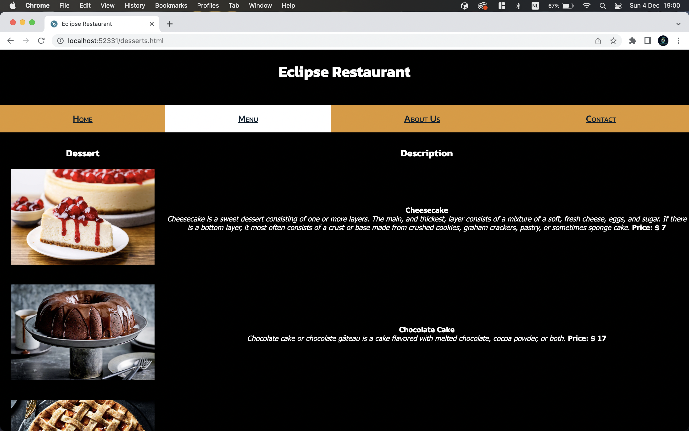

# Eclipse Restaurant
> This is a basic restaurant website demo.
> Live demo [_here_](https://christelcarbajal.github.io/eclipse-restaurant/).

## Table of Contents
* [General Info](#general-information)
* [Technologies Used](#technologies-used)
* [Screenshots](#screenshots)
* [Project Status](#project-status)
* [Room for Improvement](#room-for-improvement)
* [Acknowledgements](#acknowledgements)
* [Contact](#contact)

## General Information
- This website I made was part of a Coursera course/project "Design Restaurant Menu Website using HTML and CSS on VScode".
- This project was made for educational purposes.
- Learn the basic concepts of HTML and CSS starting with HTML elements and hyperlinks up to tables.
- Use CSS to perform your own styling such as fonts, sizes and colors.
- Build multiple html pages and style each element in them with your preference using CSS .

## Technologies Used
- Visual Studio Code - version: 1.73.1

## Screenshots

## Project Status
Project is: _completed_ 

## Room for Improvement
* Responsive web design
* Add features
* Add database 
* Include social share and follow buttons

## Acknowledgements
- This project was based on [this tutorial](https://www.coursera.org/projects/design-restaurant-menu-website-vscode).
- My Coursera [Certificate](https://www.coursera.org/account/accomplishments/verify/N66V4DAZ8TYB)

## Contact
Created by [@Creative.Dev](https://stud.hosted.hr.nl/1011926/portfolio/) - feel free to contact me!
